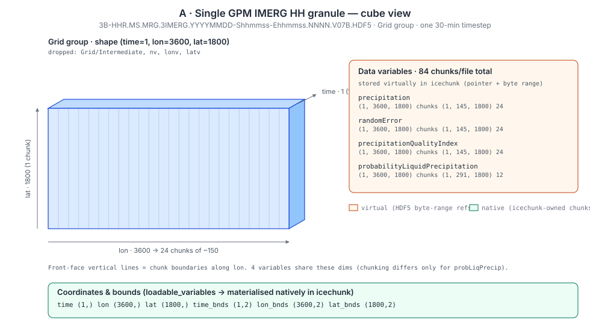
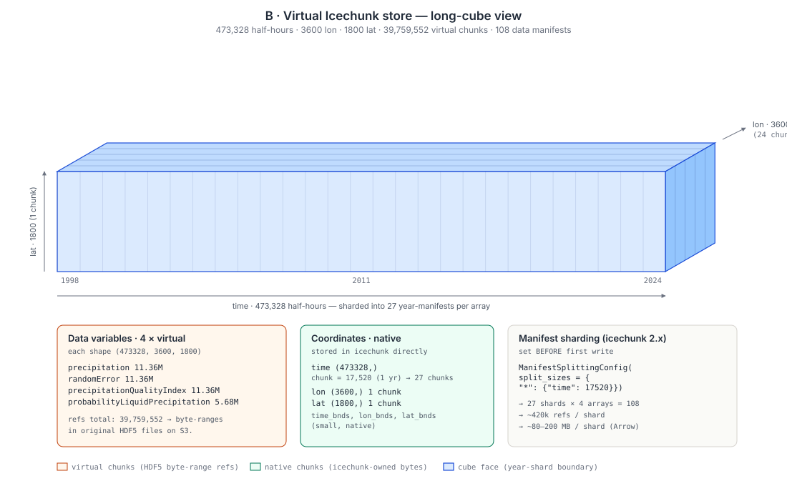

# GPM IMERG HH Virtual Icechunk Store Design Doc

## Overivew

A design for a virtual Icechunk store covering the full GPM IMERG Half-Hourly (HH) Final Precipitation record, built with VirtualiZarr, executed on Lithops, and stored in Icechunk on AWS S3.

## Goals

- Produce a single ARCO data cube spanning the full GPM IMERG HH record (1998-01-01 to 2025-09-30).
- Use serverless compute (Lithops on AWS Lambda) for parallel virtual-reference generation.
- Keep individual chunk manifests under ~500 MB by using [Icechunk manifest splitting](https://icechunk.io/en/stable/guides/performance/#splitting-manifests) to make `xr.open_zarr(...)` cheap regardless of total dataset size.
- Use region writing to enable unsequenced parallelism to virtualize the entire dataset.

## About the dataset

- Official name: **GPM IMERG Final Precipitation L3 Half Hourly 0.1° × 0.1° V07 (GPM_3IMERGHH)** at GES DISC.
- S3 bucket: `s3://gesdisc-cumulus-prod-protected/GPM_L3/GPM_3IMERGHH.07/` (us-west-2, NASA requester-pays via Earthdata STS).
- One HDF5 file per 30-min interval, 48 files/day, 473,328 files through end of 2024.

## Single granule structure



Each HDF5 file contains a `Grid` group (plus a `Grid/Intermediate` group we drop). The Grid group has dimensions `(time=1, lon=3600, lat=1800)` and the variables below. The cube view above shows the lon-chunking of the 24-chunk variables on the front face — the 12-chunk array (`probabilityLiquidPrecipitation`) chunks the same axis half as finely.

| variable | dtype | shape | chunk shape | num chunks |
|---|---|---|---|---|
| precipitation | float32 | (1, 3600, 1800) | (1, 145, 1800) | 24 |
| randomError | float32 | (1, 3600, 1800) | (1, 145, 1800) | 24 |
| precipitationQualityIndex | float32 | (1, 3600, 1800) | (1, 145, 1800) | 24 |
| probabilityLiquidPrecipitation | int16 | (1, 3600, 1800) | (1, 291, 1800) | 12 |
| time | int32 | (1,) | (32,) | (loaded natively) |
| lon | float32 | (3600,) | (3600,) | (loaded natively) |
| lat | float32 | (1800,) | (1800,) | (loaded natively) |
| time_bnds, lon_bnds, lat_bnds | — | small | small | (loaded natively) |

**Per file:** `24 + 24 + 24 + 12 = 84 virtual chunks`, 6 coordinate / bounds arrays.

**Fill Value Issue:**

There are 2 fill value concepts, well-detailed [in this VirtualiZarr documentation](https://virtualizarr.readthedocs.io/en/stable/custom_parsers.html#fill-values). The first concept, the "value for uninitialized chunks - (e.g., Zarr fill_value)", is typically parsed from the HDF5 `fill_value` attribute. This attribute is not set on GPM IMERG HH files. A fallback has been introduced in VirtualiZarr but not yet released. That is why, at time of writing, this repository uses the `virtualizarr[hdf] @ git+https://github.com/zarr-developers/virtualizarr.git@fix/problem_fillvalues` branch of VirtualiZarr.

The second fill value concept, the "sentinel value - (e.g., CF _FillValue ))" is present on the HDF5 datasets via dataset attributes. For example, `_FillValue` and `CodeMissingValue` are present on the `precipitation` HDF5 dataset as `-9999.9`.

## Drop variables, load variables

- `["Intermediate", "nv", "lonv", "latv", "time_bnds", "lon_bnds", "lat_bnds"]` variables are dropped
- All coordinates (`"time", "lon", "lat"`) are passed as `loadable_variables` so they're materialised natively in Icechunk and not stored as virtual refs.

## Final virtual Icechunk store



Conceptually the store is one root group with:

- **Four virtual data arrays**, each of shape `(time: 486480, lon: 3600, lat: 1800)`. Chunks are virtual referents to a byte range of an HDF5 file on GES DISC's S3.
- **Native coordinate arrays.** `time` is the only sizable one — 486,480 int64 values, rechunked to 17,568 per chunk (one year per chunk) so coord reads stay cheap. `lon` and `lat` are single small chunks.

Per data array:

```
number of chunks for each precipitation, randomError, precipitationQualityIndex = 486,480 × 24 = 11,675,520
number of chunks for probabilityLiquidPrecipitation = 486,480 × 12 = 5,679,936

total virtual chunks = 40,864,320
```

## Manifest sharding strategy

This is a lesson [from the store created with icechunk v1 over a year ago](https://github.com/earth-mover/icechunk-nasa/blob/main/design-docs/icechunk-stores.md): a single monolithic manifest does not scale. At 11 years of data, v1 produced a ~3 GB manifest that had to be fully downloaded on every open and every append.

**Strategy.** Split manifests 1 per year per array. Use the chunk position along `time`, with one shard per year (`17,568` half-hours for leap years).

```python
import icechunk as ic

splitting = ic.ManifestSplittingConfig(
    split_sizes={
        "precipitation":                  {"time": 17568},
        "randomError":                    {"time": 17568},
        "precipitationQualityIndex":      {"time": 17568},
        "probabilityLiquidPrecipitation": {"time": 17568},
    }
)
preload = ic.ManifestPreloadConfig(max_total_refs=0)  # don't eagerly load data manifests

config = ic.RepositoryConfig.default()
config.manifest = ic.ManifestConfig(splitting=splitting, preload=preload)
```

This produces:

- **27 shards per array × 4 arrays = 108 data manifests.**
- ~421,632 refs per shard (17568 timesteps × 24 lon-chunks).
- Roughly **80–200 MB per shard** in Icechunk 2.x's Arrow-style manifest format.
- A small, separately-stored coordinate manifest (≪ 10 MB).

**Why this works.** Opening the store with `xr.open_zarr` only needs the array metadata and the coordinate manifest. Reading a slice loads exactly the shard(s) covering that time range, in parallel. Appending a new year touches one shard per array, not the whole record.

**Critical**: Splitting must be set on the `RepositoryConfig` *before the first write*. If you ever need to retrofit, `rewrite_manifests` lets you re-split an existing repo at the cost of one rewrite.

# Cloud architecture: Lithops + region writes

## Why region writes (instead of concat + append)

IMERG filenames are **deterministic** (see [`notebooks/helpers.py#url_for`](./notebooks/helpers.py)) and each file maps to exactly one time slice. Any worker can compute a file's time index from its filename alone, so writes parallelize across all files without opening them and without commit collisions — making region writes much cleaner than a serial-append pattern.

That collapses the build pipeline to: initialize the repo with complete coordinates --> write all regions in parallel. 

## Two-stage architecture

```
┌─────────────────────────────────────────────────────────────────────┐
│ Stage 0 — Create template repo (one process, runs once)             │
│   • Compute full time index                                         │
│   • Open or create repo with ManifestSplittingConfig set            │
│   • Initialize empty arrays at final shape (one virtual placeholder)│
│   • Write coord arrays + commit                                     │
└─────────────────────────────────────────────────────────────────────┘
                                  │
                                  ▼
┌─────────────────────────────────────────────────────────────────────┐
│ Stage 1 — Lithops (fully parallel, ~ thousands of Lambdas)          │
│   • Each Lambda owns a time range (e.g. one day = 48 files)         │
│   • Authenticate to Earthdata, fetches short-lived S3 creds         │
│   • For each file in the Lambda's "region":                         |
|       open_virtual_dataset                                          |
│       write to region                                               │
│   • Commit                                                          │
└─────────────────────────────────────────────────────────────────────┘
```

### Stage 0 — Initialize

See `template_repo.py`

**TODO:** This will need to initialize the repo in an S3 bucket.

### Stage 1 — Region writes

See `write_day.py`

**TODO:** Re-work this for lithops lambda execution and writing to the same S3 bucket.

## Lithops Deployment Requirements

### Earthdata Auth

The NASA bucket needs short-lived S3 credentials via `https://data.gesdisc.earthdata.nasa.gov/s3credentials`, which authorizes via Earthdata Login credentisl. Inside lambda:

- Store `EARTHDATA_USERNAME` / `EARTHDATA_PASSWORD` in Lambda env vars (sourced from Secrets Manager or SSM Parameter Store at deploy time).
- Each Lambda calls `NasaEarthdataCredentialProvider(credentials_url)` to fetch its own STS creds. Don't pass STS creds in as task arguments — they expire in ~1 hour and the full job will run longer than that.
- Use the *icechunk-side* `s3_refreshable_credentials(get_credentials=...)` so refreshes happen automatically inside icechunk too.

### Lithops runtime image

The default Lithops runtime won't have `virtualizarr`, `icechunk`, `obstore`, `earthaccess`, `obspec_utils`. Build a custom runtime once:

```bash
lithops runtime build -f Dockerfile gpm-imerg-runtime
lithops runtime deploy gpm-imerg-runtime --memory 2048
```

**TODO:** Create and deploy runtime image with a custom Dockerfile ([example Dockerfile](https://github.com/developmentseed/mursst-icechunk-updater/blob/main/src/Dockerfile)).

### Failure handling

Region writes are *idempotent*. If you re-run the same Lambda — re-running write_day(k) just overwrites the same chunk refs with the same byte ranges. So the failure protocol is simply: collect failed futures, retry them.

### Validation

A Lambda that crashes mid-way may leave time slices it didn't get to as "empty" chunks (which Zarr fills with the configured fill value).

**TODO:** Validate after building by scanning for any timesteps that have an average of the Zarr fill value.

### Cost (order of magnitude)

**TODO:** Fact check these cost estimates

- ~10,000 Lambda invocations × ~30 s average × 2 GB ≈ a few dollars of Lambda runtime.
- S3 requests: ~473k HEAD + small GETs against `gesdisc-cumulus-prod-protected` — within same region, free egress, requests are sub-1 cent.
- Icechunk store storage: the manifests come to ~20–40 GB total; coords + metadata are small. < $1/month at S3 standard.
- Total: low double digits of dollars for the whole build.

## Memory budget

| stage | workload | peak memory per worker |
|---|---|---|
| Stage 0 init | One process, builds time array, writes coords | < 500 MB |
| Stage 1 Lambda | 48 files × 84 virtual refs each ≈ 4,032 refs in memory, plus icechunk session state | < 1 GB (2 GB Lambda is comfortable) |

## Fallback: staged + serial commits

If `virtualizarr.to_icechunk(..., region=...)` doesn't work as advertised, fall back to writing data serially, using `virtualizarr.to_icechunk(..., append_dim="time")`.

Claude suggests using the following tree-reduction strategy:

1. **Stage 1 (Lithops, parallel):** one Lambda per day. Each Lambda concats its 48 virtual datasets into a one-day VDS, serializes (Arrow / pickle of `ManifestArray`s), writes to `s3://staging/day/YYYY-MM-DD.parquet`.
2. **Stage 2 (Lithops, parallel):** one Lambda per year. Reads 365 day-VDS blobs, concats into a year-VDS, writes to `s3://staging/year/YYYY.parquet`.
3. **Stage 3 (driver, serial):** for each year, read year-VDS, `vds.vz.to_icechunk(repo, append_dim="time")`, commit.

## Implementation sequence

Following the TODOs listed above:

- [ ] **Single-Lambda dry run:** One Lambda writes one day's 48 refs into a fresh repo with splitting configured. Open with `xr.open_zarr` and verify.
- [ ] **Year-scale:** run all of 1998 (~365 Lambdas), measure per-shard manifest size, validate read latency on a random slice.
- [ ] **Concurrency stress:** run 5,000 Lambdas concurrently (5 years) and confirm the merge step holds up.
- [ ] **Full build:** all 473,328 files.
- [ ] **Validation:** scan for fill-value-heavy slices indicating failed writes; spot-check 100 random chunks against original HDF5 byte ranges.
- [ ] **Read-performance benchmark:** time-series at a point, global mean at a single timestep, regional subset over 1 year. Compare vs. opening individual HDF5 files.
- [ ] **(Future)** Batch rechunk virtual → native Icechunk for read-heavy use cases. Use the virtual store as the source.

## References

- VirtualiZarr: https://github.com/zarr-developers/VirtualiZarr
- Icechunk: https://icechunk.io
- Lithops: https://lithops-cloud.github.io
- Proof of concept: [notebooks/test-imerghh-virtualization.ipynb](./notebooks/test-imerghh-virtualization.ipynb)
- [Prior design doc (icechunk 1.x): `icechunk-stores.md`](https://github.com/earth-mover/icechunk-nasa/blob/main/design-docs/icechunk-stores.md)
